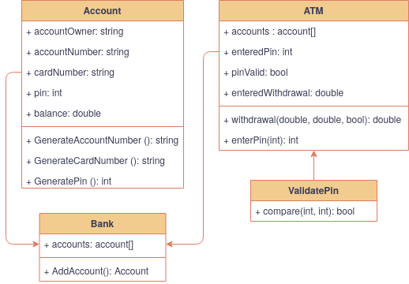

## Use case
**Actor** 

Account holder

**Trigger**

An account holder wants to withdraw money from an ATM

**Precondition**

The user is already registered at the bank

**Short description**

The actor wishes to withdraw money from his bank account. The actor approaches
the ATM, putting in his/her card and the pin associated with the card is entered
on a keypad. If the pin is correct the actor can now withdraw money within his
account's holdings.

**Normal course**
1. The actor walks up to the ATM
2. The actor inserts card linked to his account
3. The actor types in his 4 digit pin
4. ATM checks if the combination of card/account and pin match up
6. ATM displays the actors availabe currency
7. The actor enters withdrawal amount
8. If withdrawal is within the the actors spending limits
9. ATM subtracts deposited currency from the the actors account
10. ATM displays successfull subtration from the actors account

**Alternative course**
4,1. If the pin does not match up an error message appears

4,2. By the 3rd attempt the actor is asked to contact his bank

8,1. If withdrawal amount is greater than the account's holdings, the actor will be asked to try again

**Non functional additions**

Have the ability to sort out being locked out of your account, by the ATM or on a webpage

**Future expansions**

Actor can log in with his phone and an NFC reader on the ATM

## Diagram

